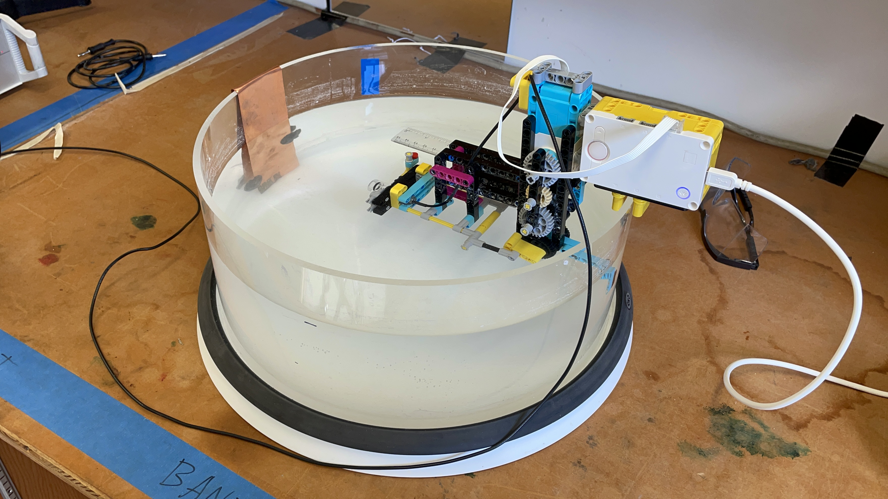
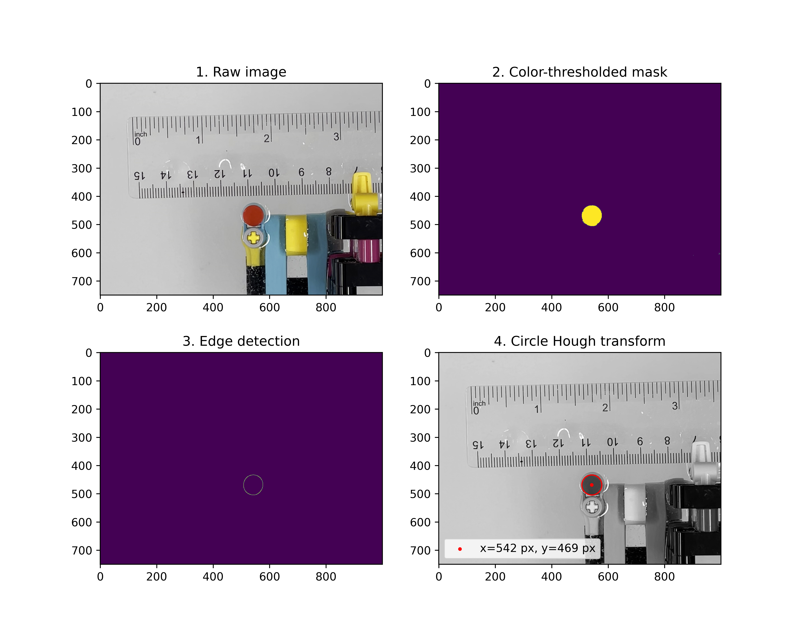
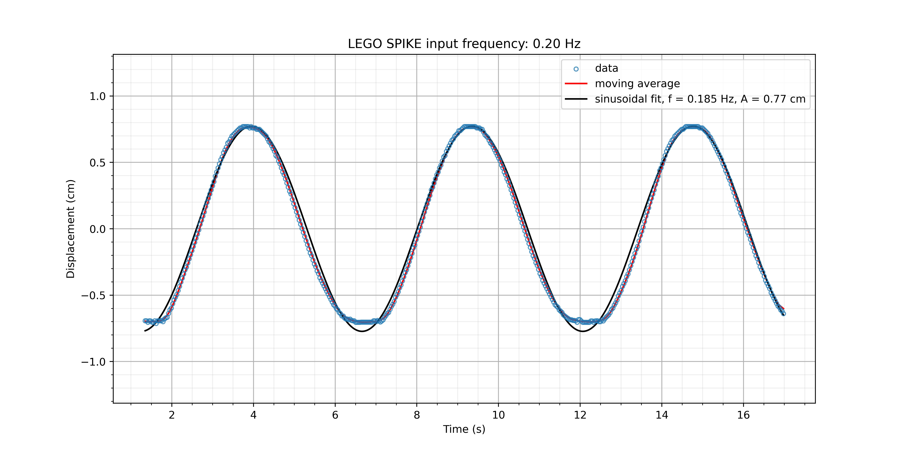
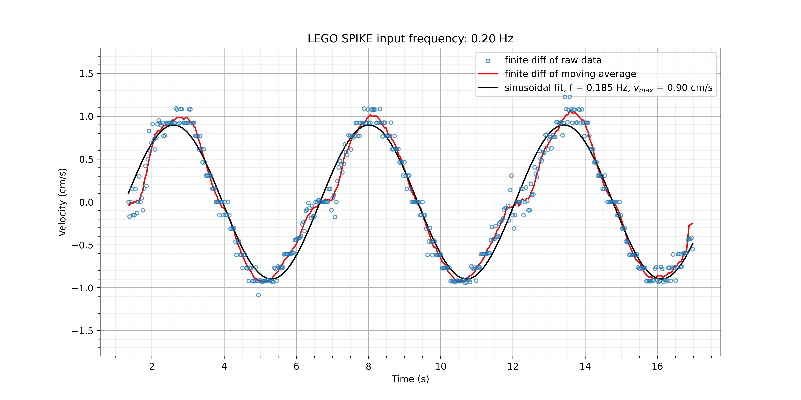

# Oscillator tracking for Ultrasonic Doppler Velocimetry (UDV) testing

Ultrasonic Doppler velocimetry (UDV) transducers can be checked for accuracy against a ground truth signal. This is easily achieved by attaching the UDV transducer to an arm that translates back and forth sinusoidally with a known frequency and displacement. The lego crank-shaft oscillating arm shown below is one such device.

This repository provides the driver code `UDV-oscillator-calibration.llsp` for running the apparatus above in LEGO SPIKE (https://education.lego.com/en-us/downloads/spike-legacy-app/software/)

The actual velocities achieved by the crank-shaft may deviate slightly from the input values, so to obtain an accurate ground truth velocity time-series, we measure the displacement of the oscillating arm from a video recording. The motion of red disk on the oscillating arm is tracked against a static ruler

The images below show the image processing pipeline in the notebook `oscillator-velocity.ipynb` used to obtain the position of the red disk's center in each video frame

A sinusoidal curve may be fit to the position of the red disk's center over time.

Finally, the velocity of the red disk (and the oscillating arm) may be computed:
